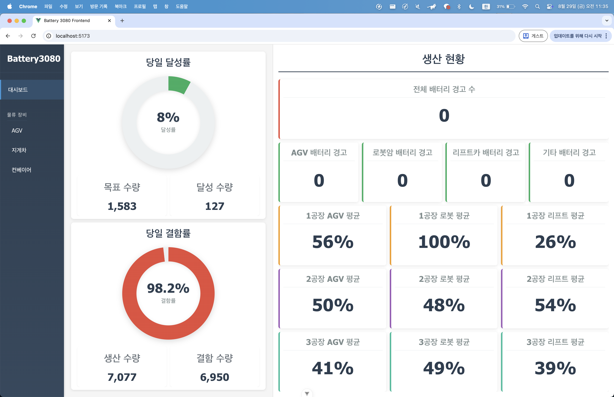
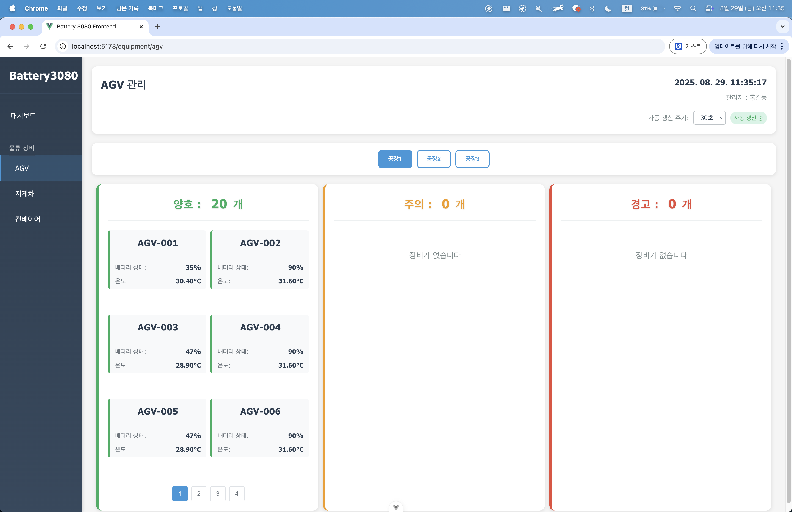
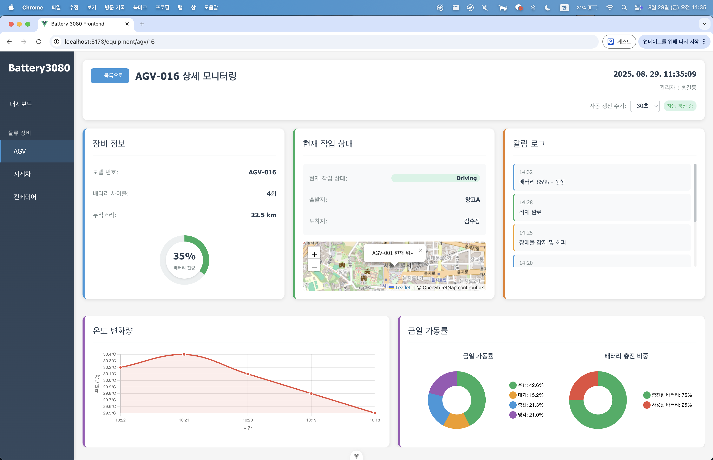
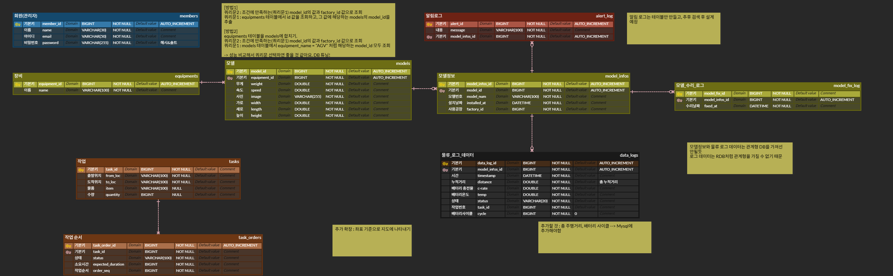

# 스마트팩토리 물류 장비 배터리 관리 시스템 (토이 프로젝트)

## 서비스 소개

-   물류 장비의 배터리 상태를 간단하게 모니터링
    -   온도에 따라 배터리 지수를 판단
-   대시보드: 장비 리스트 조회, 배터리 상태(c-rate), 수명 지수, 스트레스 지수 등 정보 표시

## 기능 구현 보완 아이디어

-   배터리 상태 데이터 보강
    -   충전 패턴 기록, 온도 데이터 반영(온도에 따라 배터리 상태 판별), 예상 주행 가능거리
-   점수 계산 고도화
    -   예상 수명 = 남은 사이클 수 / 평균 일간 충전 횟수
-   알림 기능 구현
    -   점수가 낮은 배터리 존재 시 “배터리 점검 필요” 배너 출력
    -   단순 배너 → 레벨별 알림
        -   Yellow: 점검 필요 구간
        -   Red: 교체 필요, 관리자 호출 구간

## 서브모듈 구조

    -   `frontend/` : 프론트엔드 소스 (서브모듈)
    -   `backend/` : 백엔드 소스 (서브모듈)

## 기술 스택

### 프론트엔드

-   Vue.js 3
-   JavaScript

### 백엔드

-   Java 17
-   Spring Boot 3.4
-   Spring Web
-   MyBatis
-   MySQL
-   Lombok

## API 명세서

-   [API 명세서 바로가기](https://documenter.getpostman.com/view/47875864/2sB3HewPuH)

## 팀원 소개

| 이름 | 역할                                          | GitHub                                          |
| ---- | --------------------------------------------- | ----------------------------------------------- |
| 치훈 | 데이터 생성 및 발표 자료 제작, DB 구조 설계   | [Songhyeane](https://github.com/Songhyeane)     |
| 지윤 | 장비 목록 및 상세 페이지 백엔드, DB 구조 설계 | [jiyun319](https://github.com/jiyun319)         |
| 준규 | 프론트엔드 개발, git 설정, 프로젝트 총괄      | [ParkJunGyu26](https://github.com/ParkJunGyu26) |
| 승현 | 홈 화면 백엔드 개발, API 명세서 작성          | [asho227](https://github.com/asho227)           |

## 주요 화면 소개

1. 홈/생산현황 화면 (클릭해서 보기/숨기기)

-   금일 달성률, 금일 불량률: 랜덤 값으로 임의 배정
-   전체/AGV/로봇암/리프트카/기타 배터리 경고 수 표시
-   각 공장별(3개) AGV, 로봇, 리프트 배터리 평균 수치 표시
    -   1공장 AGV, 2공장 AGV 배터리 퍼센티지만 실제 DB값, 나머지는 랜덤
-   캡처 예시:
    

2. 물류 장비 리스트 화면 (클릭해서 보기/숨기기)

-   물류 장비별, 공장별 API 호출 (path variable 적용)
-   배터리 temp(온도)에 따라 양호/주의/경고 상태 판별
-   페이징 처리, 30초마다 자동 새로고침(API 재호출)
-   캡처 예시:
    

3. 물류 장비 상세 정보 화면 (클릭해서 보기/숨기기)

-   장비 정보(모델 번호, 배터리 사이클, 누적거리), 현재 작업 상태(DB 조회)
-   출발지, 도착지, 알림 로그: 랜덤 데이터
-   그래프 3개:
    -   최근 온도 변화(5개 데이터)
    -   금일 가동률(운행, 대기, 충전, 냉각) 원형 차트
    -   배터리 충전/사용 비중 원형 차트
-   캡처 예시:
    

## ERD

아래는 데이터베이스 ERD입니다. (클릭해서 보기/숨기기)

ERD 이미지

## Git 커밋 컨벤션

-   여러 파일을 한 번에 커밋하지 말고, 각각 분리해서 add 및 커밋
-   커밋 메시지 규칙:
    -   새로운 기능 추가 → `feat: ~~~~`
    -   기존 기능 수정 → `fix: ~~~~`
    -   긴급 수정 → `hotfix: ~~~~`
    -   기타 → `chore: ~~~~`
    -   파일 위치 변경 및 최적화(리팩토링, 개선) → `refactor: ~~~~`
    -   리드미 → `docs: ~~~~`
-   예시:
    -   `feat: 로그인 기능 구현`
    -   `hotfix: 로그인 에러 수정`
    -   `chore: 파일명 변경`

## 브랜치 전략

-   `main` : 운영 브랜치
-   `dev` : 개발 통합 브랜치
-   기능/이슈별 브랜치:
    -   커밋 컨벤션(접두사)/#이슈 번호-개발 내용
    -   예시: `feat/#1-member-sign-up`
        asdf
